<div align="center">


<br/>

<a href="https://github.com/devanubhav01">
  
</a>

<br/><br/>


<br/><br/>

<a href="https://axiora-five.vercel.app/"></a>
<a href="https://www.linkedin.com/in/anubhav-singh-6867b237a/"></a>
<a href="mailto:anubhavsingh18599@gmail.com"></a>
<a href="https://github.com/devanubhav01"></a>

<br/><br/>


</div>

<br/>

---

<div align="center">

<h3><code>$ cat contributions.log</code></h3>


<br><br>

<h3><code>$ whoami --verbose</code></h3>

<table>
  <tr>
    <td valign="top"></td>
    <td valign="top"></td>
  </tr>
</table>

<br><br>

<sub>graph auto-refreshes daily via GitHub Actions</sub>

</div>

<br/>

---

## 🪶 About Me

```yaml
name: "Anubhav Singh"
role: "AI/ML Student · Full Stack Developer · DSA Enthusiast"
education: "B.Tech CSE (AI & ML), Noida Institute of Engineering & Technology (2025 - 2029)"
location: "Greater Noida, Uttar Pradesh, India"
focus:
  - Building and shipping real, production-deployed products
  - Full stack development with Next.js, MongoDB, Tailwind CSS
  - Data Structures & Algorithms in Java, one problem at a time
  - Exploring AI/ML integration into everyday software
philosophy: "Ship real products, not just tutorials."
```

I'm a first-year CSE (AI & ML) student who builds full production
systems rather than isolated demos. My flagship project, **Axiora**, is a live,
deployed AI-powered resume and portfolio builder — complete with real phone-OTP
authentication, payment integration, and cloud deployment — built while still in
my first year of college. I pair that product-engineering instinct with a
disciplined, daily grind on data structures and algorithms — **70+ problems**
solved across LeetCode and GeeksforGeeks with a 51-day active streak.

<table align="center">
<tr>
<td>

**🎯 Open To**
- Internship opportunities in Full Stack / AI Engineering
- Open source collaboration
- Freelance product builds
- Technical mentorship exchanges

</td>
</tr>
</table>

<br/>

---

## 🧬 Tech Stack

<div align="center">

**Languages**


**Frontend**


**Backend & Databases**


**Auth & Cloud**


**Tools**


</div>

<br/>

---

## 🤖 AI / ML Expertise

<div align="center">

| Domain | Proficiency | Details |
|---|:---:|---|
| Generative AI Concepts | `Intermediate` | Completed Tata GenAI Powered Data Analytics simulation (Forage) |
| AI Product Integration | `Intermediate` | Integrated AI-assisted content generation into Axiora's resume builder |
| Prompt Engineering | `Practicing` | Certified in Prompt Engineering Basics (Infosys) + Master Generative AI Tools |
| Applied ML Fundamentals | `Foundational` | Infosys Springboard coursework in Python & AI fundamentals |

</div>

<br/>

---

## 🚀 Featured Projects

<details open>
<summary><b>🔮 Axiora — AI-Powered Resume & Portfolio Platform</b></summary>
<br/>

An AI-powered resume builder and portfolio platform that lets users create
professional resumes and portfolios with GitHub integration, real
authentication, and customizable templates. It went through real engineering
hurdles — from swapping a mock OTP flow for genuine Firebase Phone
Authentication, to solving Vercel's read-only filesystem for PDF generation, to
correctly wiring OAuth redirect URIs for Google and GitHub — all resolved and
shipped to production.

| Aspect | Details |
|---|---|
| **Stack** | Next.js, React, Node.js, Express.js, MongoDB, NextAuth.js, Cloudinary, Tailwind CSS |
| **Scale** | Full-stack app with auth, GitHub integration, and dynamic PDF generation |
| **Performance** | Deployed on Vercel with environment-aware config for local + production |
| **Security** | Real OTP-based Phone Authentication, Google/GitHub OAuth, env-secured credentials |
| **Impact** | Live, publicly usable resume-building product — not a tutorial clone |
| **Repository** | [github.com/devanubhav01/Axiora](https://github.com/devanubhav01/Axiora) |
| **Live Demo** | [axiora-five.vercel.app](https://axiora-five.vercel.app/) |

</details>

<details>
<summary><b>🌍 Global Trotter</b></summary>
<br/>

A Python-based game project focused on clean game-state logic and interactive
gameplay design.

| Aspect | Details |
|---|---|
| **Stack** | Python |
| **Type** | Console / interactive game |

</details>

<details>
<summary><b>🔠 Hangman</b></summary>
<br/>

A Python-based word guessing game engineered with core programming logic,
game-state management, and a clean gameplay loop.

| Aspect | Details |
|---|---|
| **Stack** | Python |
| **Type** | Console-based word guessing game |

</details>

<br/>

---

## 💼 Experience

### **MERN Stack Development Intern** · Skill Nexis
`6-Month Internship`

Developed full stack web applications using the MERN stack, working across
both frontend and backend layers.

- Built and debugged full-stack features across frontend and backend layers
- Integrated databases and authentication into production-style applications
- Practiced REST API design and integration with MongoDB

**Skills:** `MongoDB` `Express.js` `React` `Node.js` `Full Stack`

<br/>

### **Job Simulation — GenAI Powered Data Analytics** · Tata (via Forage)

Completed a virtual job simulation applying generative AI concepts to
data analytics workflows.

**Skills:** `Generative AI` `Data Analytics`

<br/>

### **Job Simulation — Cybersecurity** · Deloitte (via Forage)

Completed a virtual job simulation covering cybersecurity fundamentals and
incident-response thinking.

**Skills:** `Cybersecurity` `Risk Analysis`

<br/>

---

## 🏆 Achievements

<div align="center">

| Recognition | Details |
|---|---|
| 🚀 Shipped Axiora to Production | Fully deployed AI resume platform with real auth & integrations — in Year 1 of college |
| 🧩 70+ Problems Solved | Across LeetCode and GeeksforGeeks combined |
| 🔥 51-Day LeetCode Streak | Consistent daily DSA practice |
| 🎓 Multiple Industry Simulations | Completed Forage simulations with Tata (GenAI) and Deloitte (Cybersecurity) |
| 🛠️ Full Dev Environment Mastery | Set up and operate a complete WSL (Ubuntu) Linux dev environment |

</div>

<br/>

---

## 📜 Certifications

<div align="center">

**MERN Stack**


**Virtual Job Simulations (Forage)**


**Infosys Springboard**


**Other**


</div>

<br/>

---

## 🧠 Coding Profiles

<div align="center">

<a href="https://leetcode.com/u/devanubhav01/"></a>
<a href="https://www.geeksforgeeks.org/profile/devanubhav01"></a>
<a href="https://codeforces.com/profile/devanubhav01"></a>

</div>

<br/>

---

## 📊 GitHub Analytics

<div align="center">


</div>

<br/>

---

## 🐍 Contribution Streak

<div align="center">


<br/>

<sub>animated snake eats through daily contributions — auto-refreshed via GitHub Actions</sub>

</div>

<br/>

---

## 🏅 GitHub Trophies

<div align="center">


</div>

<br/>

---

## 📈 Contribution Activity

<div align="center">


</div>

<br/>

---

## 🎯 Current Focus

```yaml
Learning:
  - Data Structures & Algorithms (Java)
  - Full Stack Development
  - AI & Machine Learning
  - Backend Development

Building:
  - Axiora — AI Resume Builder & Portfolio Platform

Exploring:
  - System Design
  - Generative AI
  - Cloud Computing
  - Scalable Web Applications

Open To:
  - Software Engineering Internships
  - AI/ML focused collaborations
  - Open source contributions
```

<br/>

---

## 🌐 Beyond Code

<div align="center">


</div>

<br/>

---

## 🔗 Connect With Me

<div align="center">

<a href="mailto:anubhavsingh18599@gmail.com"></a>
<a href="https://www.linkedin.com/in/anubhav-singh-6867b237a/"></a>
<a href="https://github.com/devanubhav01"></a>
<a href="https://axiora-five.vercel.app/"></a>

</div>

<br/>

---

<div align="center">

*"Build in year one what most people wait four years to attempt."*


</div>
